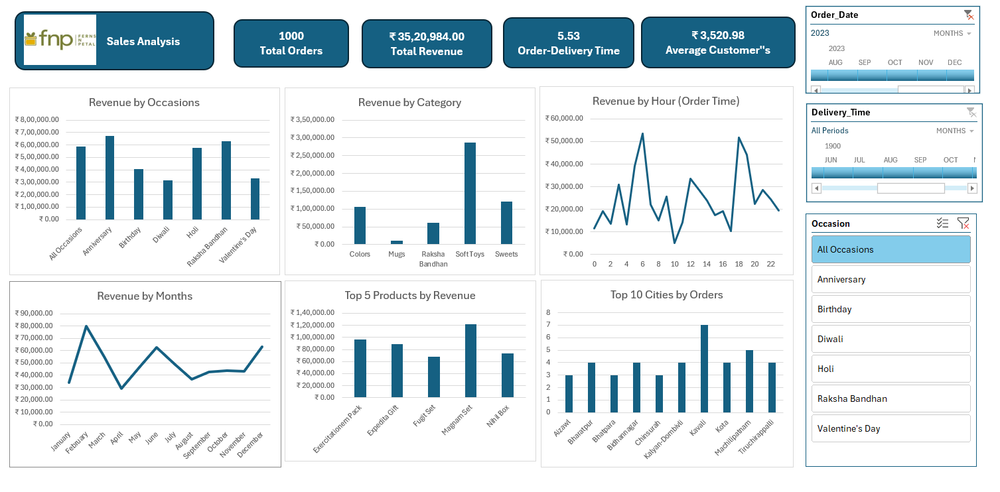
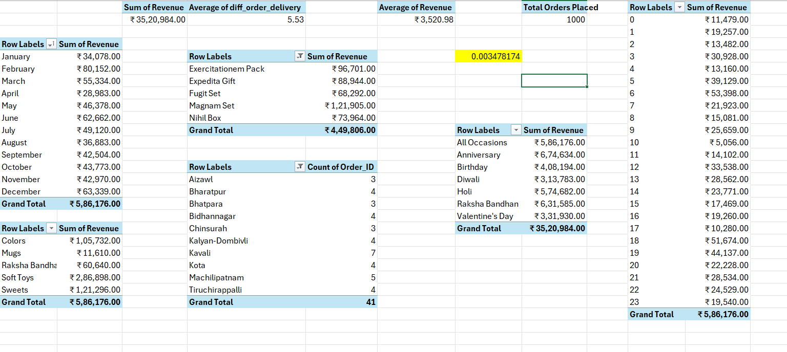

# FNP Sales Analysis Excel Dashboard

## Project Overview

This project is an interactive Sales Analysis Dashboard built using Microsoft Excel to analyze FNP sales performance and customer trends.

The dashboard helps analyze:

* Revenue performance
* Product category sales
* Customer spending patterns
* Occasion-based sales trends
* City-wise order analysis
* Monthly revenue trends

This project was created as part of my learning journey in Data Analytics by following and implementing a real-world Excel dashboard project inspired by the WsCube Tech! YouTube tutorial.

# Tools & Technologies Used

* Microsoft Excel
* Pivot Tables
* Pivot Charts
* Slicers & Filters
* KPI Cards
* Data Cleaning
* Data Visualization
* Dashboard Designing

# Features of the Dashboard

* Revenue Analysis by Occasions
* Revenue Analysis by Categories
* Revenue by Order Time
* Monthly Revenue Trends
* Top 5 Products by Revenue
* Top 10 Cities by Orders
* Interactive Filters and Slicers
* KPI Cards for Business Insights

# Key KPIs Tracked

* Total Orders
* Total Revenue
* Average Customer Spending
* Average Order Delivery Time

# Dashboard Preview

## Main Dashboard

## Pivot Table Backend Analysis

# Key Insights

* Soft Toys generated the highest revenue among all product categories.
* Anniversary and Raksha Bandhan showed strong sales performance.
* Revenue varied significantly across different hours of the day.
* Certain cities contributed more orders than others.
* Monthly sales trends fluctuated across the year.

# What I Learned

Through this project, I learned:

* Building interactive dashboards in Excel
* Using Pivot Tables for data analysis
* Creating KPI cards and charts
* Data cleaning and organization
* Business insight generation
* Dashboard storytelling and visualization

# Future Improvements

* Add customer segmentation analysis
* Add profit and cost analysis
* Create advanced Excel automation
* Integrate Power Query for better transformation
* Build the same dashboard in Power BI

# Acknowledgements

This project is inspired by the Excel Dashboard project tutorial by WsCube Tech!.

YouTube Tutorial:
https://youtu.be/Wom-eVrE4RY?si=OMwu-8Ei3rCLXzUw
